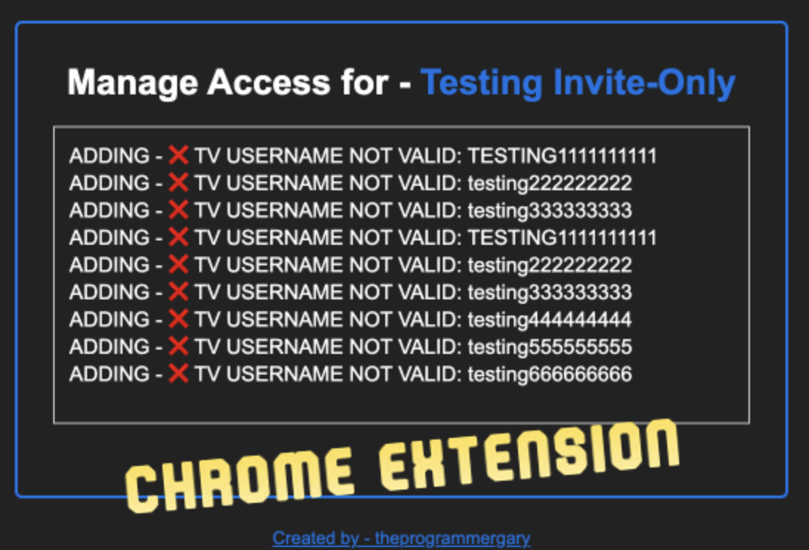

## Tradingview Indicator Manager 📈

#### About

Managing users to private Tradingview indicators is a slow and tideous process. This repo contains various solutions in different technologies to make the process better. The best solution is to fully automate the process, but that requires a custom-fit solution. In this repo you can manage access to an indicator by simply uploading a list; rather than, manually adding/removing each individual user. For more details see each individual README inside the solution's directory.

##### Images

- 

#### Contact

The entire process can be automated for your business. If you are interested in that please email me at theprogrammergary@gmail.com.

  

  <a href='mailto:theprogrammergary@gmail.com' target='_blank'>
    Contact for hire
    
  </a>

  <a href='https://ko-fi.com/M4M6RTXS2' target='_blank'>
    Support this project
    
  </a>

